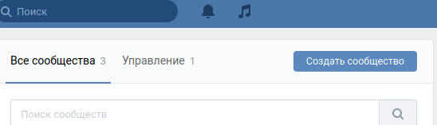
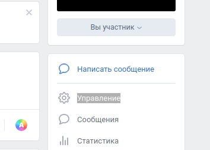
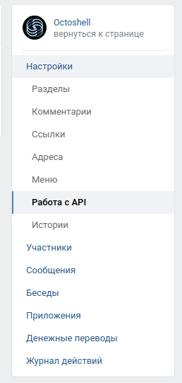
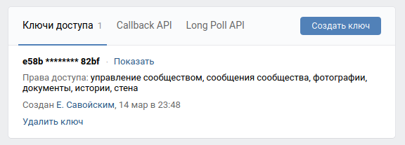
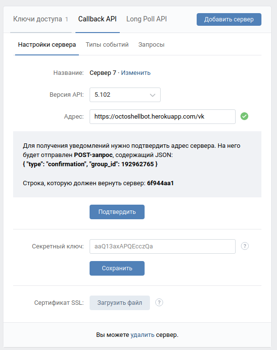
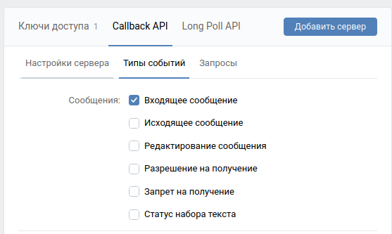
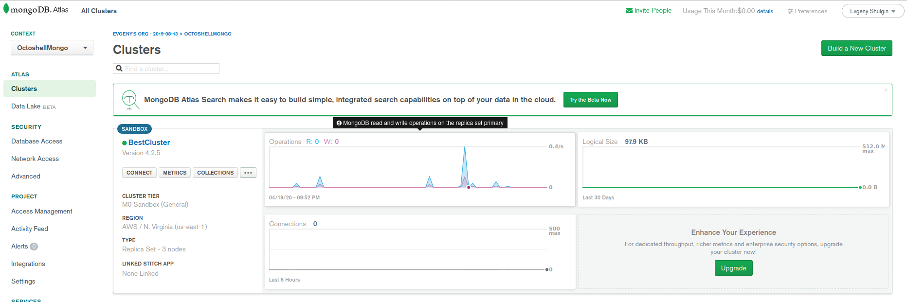

# Octoshell Telegram Bot

**Octoshell** это система управления доступом к HPC-центрам.
Оно расположено на https://users.parallel.ru.

Этот проект - вспомогательный.
Сейчас проект включает в себя **Telegram**-бота (`@OctoshellBot` или [t.me/OctoshellBot](t.me/OctoshellBot))
и **ВКонтакте**-бота (в виде сообщества https://vk.com/octoshell), но может работать и с другими ботами.

Бот написан на **Java 8** и использует Java Spring Framework, но другие библиотеки тоже,
например Apache Commons и TelegramBots.

### Как запустить проект локально по-стандартному

*Warning*: К сожалению, **ВКонтакте**-приложения требуют для работы уже запущенного на сервере приложения,
к которому **ВКонтакте** может обратиться по HTTP. **Telegram**-бот работает сразу.

0. Клонируйте или загрузите этот проект: `git clone https://github.com/Izaron/OctoshellBot.git`
0. В папке с проектом можно построить приложение из консоли: `mvn -f pom.xml clean package`
0. Чтобы не перекомпилировать проект каждый раз при изменении настроек
([application.yml](https://github.com/Izaron/OctoshellBot/blob/master/src/main/resources/application.yml)),
можно указать любой файл настроек
при запуске. Вот так запускается по умолчанию с этим файлом `java -jar target/octoshell-bot-0.0.1-SNAPSHOT.jar --spring.config.location=src/main/resources/application.yml`

### Как запустить проект по-нестандартному

Приложение можно запустить как с помощью Docker, так и отправить на Heroku, где бесплатно можно получить
доменное имя и какие-никакие ресурсы для приложения.

Документация по запуску в Heroku со скриншотами будет позже.

У автора проект лежит здесь: https://octoshellbot.herokuapp.com/.

### Как подготовить все части приложения к работе с нуля

#### Telegram-бот

Чтобы создать своего бота, нужно в Telegram зайти в чат к `@BotFather`.
Он имеет список команд (например `/newbot`) для создания бота и других вещей (к ним есть
документация в самом `@BotFather`).

От бота для настроек нам будет нужен **токен** (его даст `@BotFather`) и **юзернейм** (имя бота, например у бота, созданного автором,
юзернейм `OctoshellBot`).

По желаниюв в настройках можно включить использование прокси (`use-proxy: true`). Но на зарубежных серверах этого обычно не требуется.

#### ВКонтакте-бот

Нужно создать своё сообщество. Зайдите на https://vk.com/groups и нажмите на кнопку `Создать сообщество`

В новом сообществе зайдите в `Управление`

Выберите `Работа с API`

Вы увидите ключ доступа. Его значение нужно скопировать и сохранить в файл настроек (**vk.access-token**).

Во вкладке `Callback API` выберите версию API `5.102`. Напишите адрес, который будет принимать запросы от
ВКонтакте (это url, где крутится эта программа, плюс `/vk`).

В настройке напишите group id (**vk.group-id**) и строку, которую должен вернуть сервер (**vk.confirmation-code**)

Не забудьте подтвердить сервер, когда он будет поднят (кнопка `Подтвердить`). Также во вкладке `Типы событий` выберите тип
`Входящее сообщение`, чтобы получать уведомления о таких событиях. Одного этого типа достаточно.

Когда сервер будет готов, сообществу можно писать в сообщения, чтобы работать с этой программой.

#### Octoshell

Эта программа должна знать, куда посылать свои запросы от пользователей (в Octoshell).

По умолчанию выбран путь `http://localhost:5000/core/bot_links_api`, что работает только при поднятом
локально на порту `5000` Octoshell не старой версии.

Если выбран неправильный путь, то программа работать будет, но без взаимодействия с Octoshell.

#### MongoDB

В проекте используется защищенная и отказоустойчивая база данных MongoDB, чтобы хранить состояния пользователей и их
настройки.

Осталось указать путь до MongoDB. Сайт https://www.mongodb.com/ предлагает настроить бесплатную базу данных.

Скоро здесь появятся быстрые инструкции для создания своей базы данных, которую можно использовать в настройках.